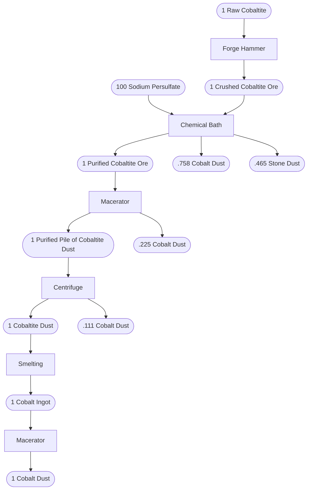
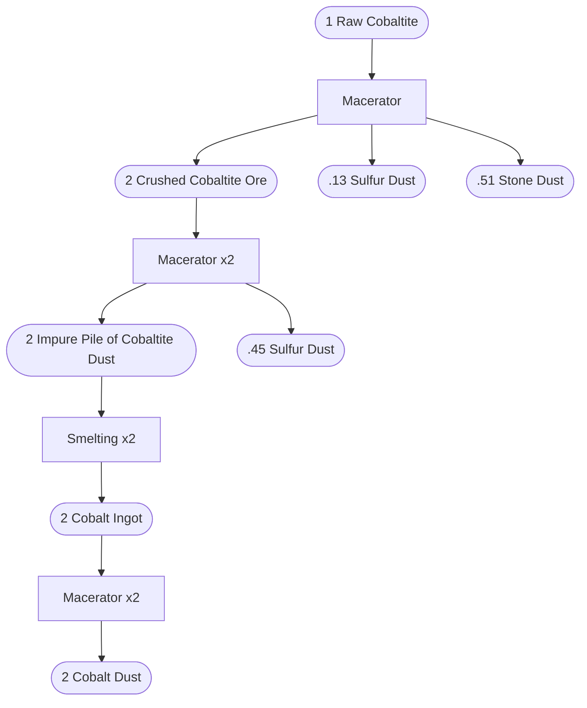

# Implementation

approach: compute for each byproduct individually

A **recipe** is a transformation of one or more **input** resources into **output** resources. It consumes **energy** and has a **duration**.

A **processing chain** is an ordered sequence of 1 or more recipes.

- Its **inputs** is the union of its recipes' inputs not supplied a previous recipe
- Its **outputs** is the union of its recipes' outputs not consumed by a further recipe
- Its **cost** is sum of its inputs' values.
- Its **value** is the sum of its outputs' values.
- Its **energy** is the sum of its recipes' energy.
- Its **duration** is the sum of its recipes' duration.

The **most efficient processing chain** is the processing chain with the (in descending priority) the highest **value**, the lowest **cost**, the lowest **energy**, the lowest **duration**.

Objective: compute the most efficient processing chain

Can this be represented with a tree?

should i just make a list of all processing chains?

let's try that.

and then we can sort it and see.

## Chain inputs/outputs

The first recipe always has "Raw Cobaltite" as the only input.

### Simple example

```text
  ┌─────────────────────────┐
  │ Recipe 1   Forge Hammer │
  │     1 Raw Cobaltite     │
  │            ↧            │
  │ 1 Crushed Cobaltite Ore │
  │ 160EU              0.5s │
  └─────────────────────────┘
  ┌──────────────────────────┐
  │ Recipe 2   Chemical Bath │
  │ 1 Crushed Cobaltite Ore  │
  │  100 Sodium Persulfate   │
  │            ↧             │
  │ 1 Purified Cobaltite Ore │
  │    0.758 Cobalt Dust     │
  │     0.465 Stone Dust     │
  │ 6000EU               10s │
  └──────────────────────────┘
  ┌───────────────────────────────────┐
  │ Recipe 3                Macerator │
  │      1 Purified Cobaltite Ore     │
  │                 ↧                 │
  │ 1 Purified Pile of Cobaltite Dust │
  │         0.225 Cobalt Dust         │
  │ 800EU                         20s │
  └───────────────────────────────────┘
  ┌───────────────────────────────────┐
  │ Recipe 4               Centrifuge │
  │ 1 Purified Pile of Cobaltite Dust │
  │                 ↧                 │
  │          1 Cobaltite Dust         │
  │         0.111 Cobalt Dust         │
  │ 500EU                          5s │
  └───────────────────────────────────┘
  ┌────────────────────┐
  │ Recipe 5  Smelting │
  │  1 Cobaltite Dust  │
  │         ↧          │
  │   1 Cobalt Ingot   │
  │ 6400EU         10s │
  └────────────────────┘
  ┌─────────────────────┐
  │ Recipe 6  Macerator │
  │    1 Cobalt Ingot   │
  │          ↧          │
  │    1 Cobalt Dust    │
  │ 118EU         2.95s │
  └─────────────────────┘
```

1-to-1 input to output mappings (no recipe multiplication needed)

Chain inputs are nodes without parents.

Chain outputs are nodes without children.



1 Raw Cobaltite, 100 Sodium Persulfate $\to$ 2.094 Cobalt Dust, .465 Stone Dust

## Complex example

```text
  ┌─────────────────────────┐
  │ Recipe 1      Macerator │
  │     1 Raw Cobaltite     │
  │            ↧            │
  │ 2 Crushed Cobaltite Ore │
  │     0.13 Sulfur Dust    │
  │     0.51 Stone Dust     │
  │ 800EU               20s │
  └─────────────────────────┘
  ┌─────────────────────────────────┐
  │ Recipe 2              Macerator │
  │     1 Crushed Cobaltite Ore     │
  │                ↧                │
  │ 1 Impure Pile of Cobaltite Dust │
  │        0.225 Sulfur Dust        │
  │ 800EU                       20s │
  └─────────────────────────────────┘
  ┌─────────────────────────────────┐
  │ Recipe 3               Smelting │
  │ 1 Impure Pile of Cobaltite Dust │
  │                ↧                │
  │          1 Cobalt Ingot         │
  │ 6400EU                      10s │
  └─────────────────────────────────┘
  ┌─────────────────────┐
  │ Recipe 4  Macerator │
  │    1 Cobalt Ingot   │
  │          ↧          │
  │    1 Cobalt Dust    │
  │ 118EU         2.95s │
  └─────────────────────┘
```



With this chain, 1 Raw Cobaltite $\to$ 2 Cobalt Dust, .58 Sulfur Dust, .51 Stone Dust

We perform r2 (Macerator) twice to consume the 2 Crushed Cobaltite Ore from r1.

This means r2's output is doubled, so further recipes must also be doubled.

We know we need to multiply r2 because the intersection of r1's output and r2's input.
